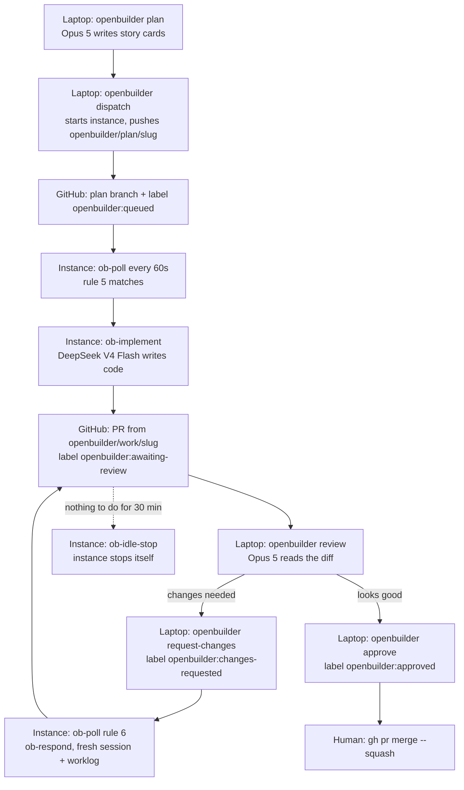

# openbuilder

A control plane for autonomous coding that splits the job across two machines and uses GitHub as the
message bus. Your laptop runs a strong, expensive model (Claude Opus 5 via `omp`) to do the two things
humans are bad at delegating — deciding *what* to build and judging whether the result is acceptable.
A small always-on arm64 EC2 instance runs a cheap, fast model (DeepSeek V4 Flash via OpenRouter) to do the
typing: it picks up plan branches, implements the stories, opens a pull request, and answers review
rounds until the reviewer approves. There is no webhook, no queue, no inbound port and no SSH — the instance
polls GitHub every 60 seconds, and stops itself when there is nothing to do. Every artifact of every
step is a branch, a commit, a PR comment or a label, so the whole system is auditable with `git log`
and `gh`.

## How it flows



Three roles, three different cost profiles:

| Role | Where | Model | Job |
|---|---|---|---|
| planner | laptop | `amazon-bedrock/us.anthropic.claude-opus-5` | turn an idea into backlog story cards, push a plan branch |
| implementer | EC2 `t4g.medium` | `openrouter/deepseek/deepseek-v4-flash-0731` | implement stories, open a PR, answer review rounds |
| reviewer | laptop | `amazon-bedrock/us.anthropic.claude-opus-5` | review the PR, post comments, gate the merge |

The instance **auto-stops when idle** (no lock held, no actionable work, nothing touched for
`OPENBUILDER_IDLE_STOP_MINUTES`, default 30). That is safe because the laptop CLI **starts the instance
before it creates work** — `openbuilder dispatch` and `openbuilder review` both call
`aws ec2 start-instances` and wait for the instance to come up. A stopped instance is never a missed trigger.

## Quickstart: zero to first merged PR

Everything below is copy-pasteable. Replace `you/your-repo` with the repo you want the agent to work in.

### 0. Prerequisites

| Tool | Minimum | Check |
|---|---|---|
| Terraform | `>= 1.6.0` | `terraform version` |
| AWS CLI | v2 | `aws --version` |
| GitHub CLI | any recent | `gh auth status` |
| omp | `17.2.11` | `omp --version` |
| `jq` | 1.6+ | `jq --version` |
| `git` | any recent | `git --version` |
| Session Manager plugin | any | `session-manager-plugin --version` |
| An AWS account | — | see below |
| An OpenRouter API key | — | https://openrouter.ai/keys |

The Session Manager plugin is what makes `openbuilder shell` work; without it every other subcommand
still functions, because they use `ssm send-command` rather than an interactive session.

```sh
brew install --cask session-manager-plugin        # macOS
```

#### AWS credentials for the deploy

Use a **dedicated profile** for this project. Do not rely on whatever `AWS_PROFILE` your shell happens
to export — that is frequently a work SSO profile for an unrelated account, and Terraform obeys it.

`aws configure sso` is **not** the command you want: that is for IAM Identity Center, which most
personal accounts do not have. If the only SSO start URL on your machine belongs to an employer, it
points at exactly the account this must not deploy into.

##### Recommended: `aws login`, no stored secret

AWS CLI 2.32.0+ can mint temporary credentials from a browser sign-in and refresh them automatically,
so no long-lived access key ever lands on disk. This module requires `hashicorp/aws` **>= 6.23.0** for
it, which is what `versions.tf` pins — support was added in that release.

1. Console → **IAM → Users → Create user**, `openbuilder-deploy`, **with** console access (you sign in
   as this user in the browser).
2. **Attach policies directly:** `AdministratorAccess` **and** `SignInLocalDevelopmentAccess`.
   The second is what permits `aws login` itself; the first is because this module creates a VPC, an
   EC2 instance, an IAM role and instance profile, four SSM parameters and a budget.
   `PowerUserAccess` is *not* enough — it cannot create the instance role.
3. Declare the profile in `~/.aws/config`. **Substitute your real 12-digit account id** — it is in the
   console's top-right account menu. The literal `ACCOUNT_ID` below will not work:

```ini
[profile openbuilder-deploy]
login_session = arn:aws:iam::ACCOUNT_ID:user/openbuilder-deploy
region        = eu-central-1
```

4. In the browser, sign in **as `openbuilder-deploy`**, not as the account root. Then:

```sh
aws login --profile openbuilder-deploy
aws sts get-caller-identity --profile openbuilder-deploy   # must be YOUR account id
```

`aws login` derives the session from whoever is signed into the browser. If you are signed in as root
it will offer to rewrite the profile to `arn:aws:iam::<id>:root` — answer **n**, switch the browser to
the IAM user, and rerun. Root works, but it cannot be scoped or revoked granularly.

The session lasts up to 12 hours; re-run `aws login` when it lapses, and `aws logout --profile
openbuilder-deploy` to end it early. Tokens are cached in `~/.aws/login/cache/`, never in
`~/.aws/credentials`. A `terraform apply` running longer than the session will fail on expiry — not a
concern here, since this module applies in a couple of minutes.

##### Fallback: static access key

If you would rather not use `aws login`, create the same user without console access, skip
`SignInLocalDevelopmentAccess`, then **Security credentials → Create access key → CLI** and run
`aws configure --profile openbuilder-deploy`, answering with the key, the secret, `eu-central-1` and
`json`. This works with any provider version. The tradeoff is a long-lived secret sitting in
`~/.aws/credentials`, which is precisely what the console warns you about.

##### Either way

Put the profile name in **two** places, so neither Terraform nor the CLI can wander into another
account: `aws_profile` in `infra/terraform.tfvars`, and `OPENBUILDER_AWS_PROFILE` in
`.openbuilder.local`.

Your laptop separately needs Amazon Bedrock access to `us.anthropic.claude-opus-5`, because the planner
and reviewer run locally against that model. That is a different account and region from the instance,
and it keeps using your normal `AWS_PROFILE`/`AWS_REGION` — the CLI never touches those.

### 1. Get this repo onto GitHub

Cloud-init clones the control repo onto the instance over plain HTTPS, so the simplest setup is a public
control repo.

```sh
git clone https://github.com/artemkurylo/openbuilder.git
cd openbuilder
```

Building it from scratch instead? From the repo root:

```sh
make repo-create
```

> If you make the control repo private, add it to the GitHub App installation in step 2 as well —
> the first cloud-init clone will fail (logged, not fatal) and `ob-selfupdate` will pick it up later
> with an App token.

### 2. Create the GitHub App

Follow **[docs/github-app-setup.md](docs/github-app-setup.md)**. It walks the exact click-path and ends
with three values you will need in step 5:

- the numeric **App ID**
- the numeric **installation ID**
- the downloaded **private key PEM**

Permissions are Contents RW, Pull requests RW, Issues RW, Metadata RO, Workflows RW. No webhook.

### 3. Initialise Terraform

```sh
make init
```

This runs `terraform init` in `infra/` and creates `infra/terraform.tfvars` from
`infra/terraform.tfvars.example` if it does not exist yet.

### 4. Fill in `infra/terraform.tfvars`

Open `infra/terraform.tfvars` and set at minimum:

```hcl
region             = "eu-central-1"
repos              = ["you/your-repo"]
control_repo       = "artemkurylo/openbuilder"
budget_alert_email = "you@example.com"
```

`repos` is the allowlist. The instance will only ever look at plan branches in these repositories, and the
App installation token is scoped to them. Everything else has a sane default (`t4g.medium`, 40 GiB gp3,
`/openbuilder` SSM prefix, 45m max runtime, 6 max attempts, 30 min idle stop, `monthly_budget_usd = 20`).

The budget that `budget_alert_email` arms covers **AWS spend only** — OpenRouter bills the model
separately and the AWS budget can never see it. Set a hard spend limit on the OpenRouter key too.

### 5. Create the infrastructure

```sh
make plan-tf     # read the plan; expect a VPC, one public subnet, an IGW, an SG with zero ingress,
                 # an IAM role, four SSM parameters and one EC2 instance
make apply
```

Terraform creates the four SSM parameters with the placeholder value `REPLACE_ME` and then
**never touches their contents again** (`lifecycle { ignore_changes = [value] }`).

### 6. Put the three secrets into SSM

```sh
make secrets
```

That prints the exact commands with placeholders. Run them with your real values:

```sh
aws ssm put-parameter --overwrite --name /openbuilder/openrouter_api_key \
  --type SecureString --value 'sk-or-v1-REPLACE_ME' --region eu-central-1

aws ssm put-parameter --overwrite --name /openbuilder/github_app_id \
  --type String --value 'REPLACE_ME' --region eu-central-1

aws ssm put-parameter --overwrite --name /openbuilder/github_app_installation_id \
  --type String --value 'REPLACE_ME' --region eu-central-1

aws ssm put-parameter --overwrite --name /openbuilder/github_app_private_key \
  --type SecureString --value "$(cat ~/Downloads/openbuilder-bot.private-key.pem)" --region eu-central-1
```

Nothing secret is ever written to `/opt/openbuilder/etc/openbuilder.env`. The runner fetches these with
`aws ssm get-parameter --with-decryption` at job start and exports them into the `omp` child process only.

### 7. Point the laptop CLI at the instance

```sh
cat > .openbuilder.local <<'EOF'
OPENBUILDER_INSTANCE_ID=i-REPLACE_ME
OPENBUILDER_REGION=eu-central-1
OPENBUILDER_TARGET_REPO=you/your-repo
# Only needed when your shell's AWS_PROFILE points somewhere else — e.g. at an
# account that just serves the local planner/reviewer model. EC2/SSM calls for
# the instance use this profile; the local `omp` session is left completely alone.
OPENBUILDER_AWS_PROFILE=your-personal-profile
EOF
```

The CLI deliberately ignores `AWS_REGION` and `AWS_DEFAULT_REGION` when deciding where the instance lives:
those belong to your local model provider and are frequently a different region entirely. Only
`OPENBUILDER_REGION`, the cached value, or the `region` Terraform output can set it.

`terraform output instance_id` (or the tail of `make apply`) gives you the instance id. Then put the CLI
on your `PATH`:

```sh
export PATH="$PWD/local/bin:$PATH"
```

### 8. Verify the instance

```sh
make doctor
```

`ob-doctor` runs on the instance over SSM and prints a PASS/FAIL table: binaries and versions, env file
parsed, every SSM parameter readable, App token mints and `gh api user` works, every repo in
`OPENBUILDER_REPOS` reachable and writable, `OPENROUTER_API_KEY` valid via a one-token `omp` call, both
systemd timers active, disk free. **Do not continue until every row is PASS.**

### 9. Plan a change

```sh
openbuilder plan you/your-repo healthz-endpoint
```

Opus 5 runs locally with the planner agent and scaffolds
`.openbuilder/backlog/healthz-endpoint/` — a `plan.md` plus one `story-NN-*.md` per slice. Read them.
Edit them. This is the highest-leverage five minutes in the whole loop; the remote agent will do exactly
what these cards say and nothing more. The contract is [backlog/SCHEMA.md](backlog/SCHEMA.md), and
[backlog/example/plan.md](backlog/example/plan.md) plus its story card is a filled-in pair to compare
against.

### 10. Dispatch

```sh
openbuilder dispatch you/your-repo healthz-endpoint
```

This starts the instance and waits for it, commits the backlog directory, pushes
`openbuilder/plan/healthz-endpoint`, and makes sure the six `openbuilder:*` labels exist in the repo.

### 11. Wait for the PR

```sh
openbuilder status you/your-repo
```

Within ~60 seconds `ob-poll` matches rule 5 (no PR with head `openbuilder/work/healthz-endpoint`) and
runs `ob-implement`. The label goes `openbuilder:queued` → `openbuilder:in-progress` →
`openbuilder:awaiting-review`, and a PR appears whose title is the first `# ` heading of `plan.md`.
Watch it happen with:

```sh
openbuilder logs -f
```

### 12. Review

```sh
openbuilder review you/your-repo 42
```

Opus 5 reads the diff, the plan, the worklog and the repo, then posts line-anchored comments and a
verdict. Act on the verdict:

```sh
openbuilder request-changes you/your-repo 42   # -> instance runs ob-respond on the next poll
```

Each `request-changes` costs one attempt. After `OPENBUILDER_MAX_ATTEMPTS` (6) the instance labels the PR
`openbuilder:blocked` and stops touching it.

### 13. Approve and merge

```sh
openbuilder approve you/your-repo 42
gh pr merge 42 --repo you/your-repo --squash --delete-branch
```

`openbuilder:approved` is the instance's stop sign: rule 2 in the state machine skips that slug forever.
**Only a human merges.** The remote agent is blocked from merging, force-pushing and pushing to a
default branch by the guardrails hook, and never has a reason to try.

Thirty minutes later `ob-idle-stop` powers the instance down and your spend drops to the EBS volume.

## The daily loop

Once the setup above is done, a normal day is four commands:

```sh
openbuilder plan     you/your-repo add-rate-limit   # think, then edit the story cards
openbuilder dispatch you/your-repo add-rate-limit   # starts the instance, pushes the plan branch
openbuilder review   you/your-repo 43               # Opus 5 reviews; you read its verdict
openbuilder approve  you/your-repo 43               # then gh pr merge
```

Everything else is observation:

| Command | What it does |
|---|---|
| `openbuilder status [owner/repo]` | table of slugs, branches, PRs, labels, last action |
| `openbuilder logs [-f]` | tail `/opt/openbuilder/log/openbuilder.log` over SSM |
| `openbuilder cost` | sum `.message.usage.cost.total` across the instance's `run.ndjson` files |
| `openbuilder doctor` | run `ob-doctor` on the instance |
| `openbuilder shell` | `aws ssm start-session` onto the instance |
| `openbuilder start` / `openbuilder stop` | instance power, by hand |

You can queue several slugs at once. `ob-poll` takes **one action per slug per pass** and holds a
per-slug lock, so parallel plan branches make progress round-robin instead of stampeding.

## What it costs

Approximate `eu-central-1` on-demand pricing, 730 hours/month. The `t4g.medium` hourly rate is verified
against AWS's published EU (Frankfurt) pricing; the gp3 rate is **approximate and unverified**. See
[docs/cost.md](docs/cost.md) for the full arithmetic.

| Item | Assumption | Monthly (approx.) |
|---|---|---|
| EC2 `t4g.medium`, always on | 730 h @ $0.0384/h (verified) | ~$28.03 |
| EC2 `t4g.medium`, idle auto-stop | 240 h @ $0.0384/h (verified) | ~$9.22 |
| Public IPv4 address | ~$0.005/h while running, 240 h | ~$1.20 |
| EBS 40 GiB gp3 | ~$0.095/GB-month (approximate), billed 24/7 while stopped | ~$3.80 |
| DeepSeek V4 Flash tokens | 20 stories @ 350k in / 45k out | ~$0.79 |
| SSM Session Manager, Parameter Store (standard), KMS, CloudWatch metrics | — | ~$0.00 |
| **Total with idle auto-stop** (8 h/day awake, assumed) | 240 h | **~$15.01/mo** |
| **Total always-on** (730 h) | 730 h | **~$36.27/mo** |

The model is not the expensive part. The instance is — which is why idle auto-stop exists, and why
there is no NAT gateway (~$32/mo) or interface endpoint pair (~$22/mo) in the design. The gp3 volume is
the one line auto-stop cannot touch: $3.80/month whether the instance runs or not, which is the whole bill of
a stopped month.

The default `monthly_budget_usd = 20` is enough for an auto-stopping instance (~$14.22 of AWS spend, 71% of
budget, so the 80% alert at $16 never fires) and **not** enough always-on (~$35.48 of AWS spend). Either
way the budget covers **AWS spend only** — the DeepSeek tokens are billed by OpenRouter and are invisible
to it.

## Repo layout

```
openbuilder/
├── README.md                 this file: what it is, quickstart, daily loop
├── Makefile                  targets: help init plan-tf apply destroy secrets doctor shell logs status fmt lint repo-create
├── docs/                     architecture, day-2 runbook, GitHub App setup, cost math
├── infra/                    Terraform: VPC, public subnet, IAM, SSM params, instance, budget
├── infra/templates/          cloud-init template that renders openbuilder.env and calls bootstrap.sh
├── runner/                   everything that runs ON the instance
├── runner/bin/               ob-common.sh, ob-token, ob-poll, ob-implement, ob-respond, ob-idle-stop, ob-doctor, ob-selfupdate
├── runner/systemd/           the poll timer (60s) and the idle timer (5m) and their oneshot services
├── runner/prompts/           implement.md / respond.md templates fed to omp with {{PLACEHOLDER}} markers
├── agent/remote/             omp config + implementer agent installed to /opt/openbuilder/.omp
├── agent/local/              omp planner + reviewer agents and their skills, for your laptop
├── agent/hooks/              pre-tool-call guardrails hook: no merge, no force-push, no push to main
├── backlog/                  SCHEMA.md — the story-card contract — plus a filled-in example
└── local/bin/                the `openbuilder` laptop CLI
```

## Troubleshooting

Full playbook in [docs/runbook.md](docs/runbook.md). The fast table:

| Symptom | Likely cause | Command to run |
|---|---|---|
| `openbuilder dispatch` pushed but no PR after 5 min | instance stopped, or poll timer not firing | `openbuilder status` then `openbuilder start`, then `openbuilder shell` and `systemctl list-timers 'openbuilder-*'` |
| PR stuck on `openbuilder:in-progress` | job died mid-run, stale lock, or `OPENBUILDER_MAX_RUNTIME` hit | `openbuilder logs` then `openbuilder shell` and `ls -l /opt/openbuilder/run/` |
| `openbuilder:blocked` appeared | max attempts reached, or a hard failure — the reason is in a PR comment, or in a `openbuilder blocked: <slug>` issue if it failed before the PR existed | `gh pr view <pr> --repo you/your-repo --comments` |
| No commits, agent "explained" instead | story card was ambiguous; the agent is told to stop rather than guess | read `.openbuilder/backlog/<slug>/worklog.md` on the work branch, tighten the card, re-dispatch |
| `gh` calls fail with 401 | App token expired or the App is not installed on that repo | `openbuilder shell` then `sudo -u openbuilder /opt/openbuilder/bin/ob-doctor` |
| omp exits instantly, no tokens spent | bad or out-of-credit `OPENROUTER_API_KEY` (429 / 402) | `openbuilder doctor`, then re-put `/openbuilder/openrouter_api_key` |
| Instance never stops, bill keeps growing | idle timer not firing, or work is genuinely queued | `openbuilder shell` then `sudo -u openbuilder /opt/openbuilder/bin/ob-poll --dry-run` |
| Disk full, git operations fail | accumulated worktrees, caches and `run.ndjson` files | `openbuilder shell` then `df -h /opt/openbuilder` |
| Instance running old scripts after a control-repo push | instance has not self-updated | `openbuilder shell` then `sudo -u openbuilder /opt/openbuilder/bin/ob-selfupdate` |

One thing that looks like a fault and is not: **`openbuilder logs` is empty on an idle instance.** Only real
work writes to `/opt/openbuilder/log/openbuilder.log`; uneventful poll passes go to the journal only, on
purpose, because idle auto-stop watches that file's mtime. For the noisy per-decision view use
`openbuilder shell` and
`sudo journalctl -u openbuilder-poll.service --since today | grep DECISION`.

## Where to read next

- [docs/architecture.md](docs/architecture.md) — components, the full state machine, the sequence
  diagram, the design decisions and their tradeoffs, and the security model.
- [docs/github-app-setup.md](docs/github-app-setup.md) — one-time identity setup.
- [docs/runbook.md](docs/runbook.md) — symptom-driven day-2 operations.
- [docs/cost.md](docs/cost.md) — the money, itemised.
- [backlog/SCHEMA.md](backlog/SCHEMA.md) — how to write a story card the remote agent can actually execute.
