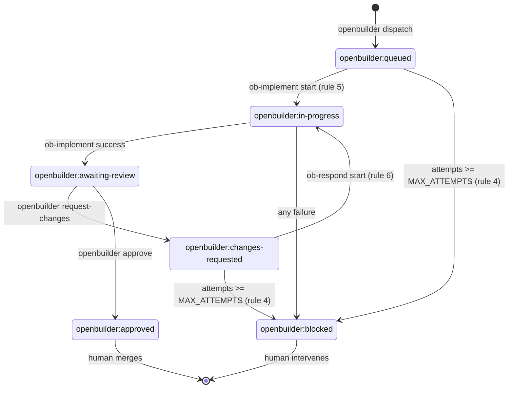
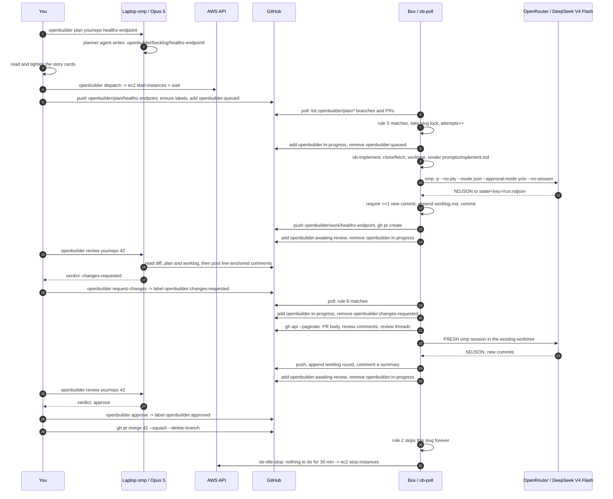

# Architecture

## 1. Component inventory

### On your laptop

| Component | Path | What it is |
|---|---|---|
| `openbuilder` CLI | `local/bin/openbuilder` | Bash. The only thing you type. Reads `OPENBUILDER_INSTANCE_ID`, `OPENBUILDER_REGION`, `OPENBUILDER_TARGET_REPO`, sourcing `.openbuilder.local` if present. Subcommands: `plan`, `dispatch`, `review`, `approve`, `request-changes`, `status`, `logs`, `shell`, `doctor`, `start`, `stop`, `cost`. |
| `Makefile` | `Makefile` | Wrappers for the one-time setup and the observation commands: `help` (default), `init`, `plan-tf`, `apply`, `destroy`, `secrets`, `doctor`, `shell`, `logs`, `status`, `fmt`, `lint`, `repo-create`. |
| planner agent | `agent/local/agents/planner.md` | Opus 5. Emits story cards per `backlog/SCHEMA.md`. |
| reviewer agent | `agent/local/agents/reviewer.md` | Opus 5. Emits `approve` or `changes-requested` plus line-anchored comments. Read-only tools plus `github` and `bash`. |
| skills | `agent/local/agents/skills/write-backlog/`, `.../review-openbuilder-pr/` | How to slice work; the review rubric and the exact `gh` commands. |

Every remote call from the laptop goes through `aws ssm send-command` (document `AWS-RunShellScript`) or
`aws ssm start-session`. There is never an SSH connection, because there is no SSH daemon reachable and no
key pair in the design at all.

### On GitHub (the message bus)

| Artifact | Name | Written by |
|---|---|---|
| plan branch | `openbuilder/plan/<slug>` | laptop (`dispatch`) |
| work branch | `openbuilder/work/<slug>` | box (`ob-implement`) |
| story cards | `.openbuilder/backlog/<slug>/plan.md`, `story-<NN>-<name>.md` | laptop, committed on the plan branch |
| worklog | `.openbuilder/backlog/<slug>/worklog.md` | box, committed on the work branch, appended once per round |
| pull request | head `openbuilder/work/<slug>` | box |
| labels | `openbuilder:queued`, `:in-progress`, `:awaiting-review`, `:changes-requested`, `:approved`, `:blocked` | both |

`<slug>` matches `^[a-z0-9][a-z0-9-]{1,48}$`. There is no other channel. No webhook endpoint, no queue,
no database — if it is not a branch, a commit, a comment or a label, it does not exist.

### On the box

| Component | Path | What it is |
|---|---|---|
| `ob-poll` | `/opt/openbuilder/bin/ob-poll` | The clock. Runs the §2 state machine. `--dry-run` prints decisions without acting. Global `poll` lock so passes never overlap. Ensures the six labels exist once per pass. |
| `ob-implement` | `/opt/openbuilder/bin/ob-implement` | `<owner/repo> <slug>`. Clone/fetch to `src/`, branch off the plan branch's merge-base with the default branch, create the worktree, read every `story-*.md` in slug order, render `prompts/implement.md`, run omp, require ≥1 new commit, append to `worklog.md`, push, `gh pr create`. |
| `ob-respond` | `/opt/openbuilder/bin/ob-respond` | `<owner/repo> <slug> <pr>`. Pull the PR body, review comments and review threads via `gh api --paginate`, render `prompts/respond.md`, run a **fresh** omp session in the existing worktree, require ≥1 new commit, append the round to `worklog.md`, push, comment. |
| `ob-idle-stop` | `/opt/openbuilder/bin/ob-idle-stop` | Stops the instance when no lock is held, `ob-poll --dry-run` reports no actionable work, and the newest mtime across `state/` and the log is older than `OPENBUILDER_IDLE_STOP_MINUTES`. |
| `ob-token` | `/opt/openbuilder/bin/ob-token` | Mints a GitHub App installation access token: RS256 JWT via `openssl dgst -sha256 -sign`, `iat = now-60`, `exp = now+540`, POST to `/app/installations/<id>/access_tokens`. Caches at `cache/gh-token.json` (0600), reuses while >5 min from `expires_at`. |
| `ob-doctor` | `/opt/openbuilder/bin/ob-doctor` | Preflight PASS/FAIL table. Non-zero exit on any FAIL. |
| `ob-selfupdate` | `/opt/openbuilder/bin/ob-selfupdate` | `git -C /opt/openbuilder/repo pull --ff-only` then re-run `bootstrap.sh`. |
| `ob-common.sh` | `/opt/openbuilder/bin/ob-common.sh` | Sourced library: logging, locking, SSM reads, slug keys, attempt counters, `gh` wrapper, label add/remove, the verified omp invocation, NDJSON text and cost extraction, secret redaction. |
| systemd | `openbuilder-poll.timer` (60s), `openbuilder-idle.timer` (5m) | `Type=oneshot` services running as `User=openbuilder` with `EnvironmentFile=/opt/openbuilder/etc/openbuilder.env`. |
| omp | `/usr/local/bin/omp` | Self-contained bun binary, `omp-linux-arm64`, checksum-verified against `SHA256SUMS.txt`. |
| implementer agent | `/opt/openbuilder/agent/agents/implementer.md` | Tools `read,grep,glob,write,edit,bash,lsp,todo,task,github,yield`. No `browser`, no `web_search`. |

### Box filesystem

```
/opt/openbuilder                                 OPENBUILDER_HOME, home of the openbuilder system user
/opt/openbuilder/bin/                            runner scripts
/opt/openbuilder/prompts/                        implement.md, respond.md
/opt/openbuilder/agent/                          omp config.yml + agents/
/opt/openbuilder/etc/openbuilder.env             non-secret config, rendered by cloud-init
/opt/openbuilder/repo/                           checkout of this control repo (self-update source)
/opt/openbuilder/src/<owner>__<repo>/            git clone of a target repo
/opt/openbuilder/work/<owner>__<repo>__<slug>/   git worktree for one story set
/opt/openbuilder/state/<owner>__<repo>__<slug>/  run.ndjson, sessions/, attempt counters
/opt/openbuilder/log/openbuilder.log             append-only operational log
/opt/openbuilder/run/                            lockfiles
/opt/openbuilder/cache/gh-token.json             cached installation token, mode 0600
```

### On AWS

One VPC, one internet gateway, **one public subnet** with `map_public_ip_on_launch = true`, one route
table, and a security group with **zero ingress rules** and egress-all. One IAM role and instance
profile with `AmazonSSMManagedInstanceCore` plus an inline policy for the four SSM parameters,
`kms:Decrypt` on `alias/aws/ssm` (via a `kms:ViaService` condition), tag-conditioned `ec2:StopInstances`,
read-only `ec2:DescribeInstances`/`ec2:DescribeTags`, and `cloudwatch:PutMetricData` scoped to the
`OpenBuilder` namespace. Four SSM parameters under `/openbuilder`. One `t4g.medium` instance with
`http_tokens = "required"` and an encrypted 100 GB gp3 root volume. One optional monthly cost budget.

Every resource is tagged `openbuilder:managed = "true"`, `Project = "openbuilder"`,
`Name = "<name_prefix>-<resource>"`.

### Environment contract

`/opt/openbuilder/etc/openbuilder.env` is rendered once by cloud-init from Terraform variables and
sourced by every runner script. The names are frozen:

```
OPENBUILDER_HOME, OPENBUILDER_SSM_PREFIX, OPENBUILDER_REPOS, OPENBUILDER_CONTROL_REPO,
OPENBUILDER_GH_HOST, OPENBUILDER_MODEL, OPENBUILDER_SMOL_MODEL, OPENBUILDER_MAX_RUNTIME,
OPENBUILDER_MAX_ATTEMPTS, OPENBUILDER_IDLE_STOP_MINUTES, OPENBUILDER_BRANCH_PREFIX,
OPENBUILDER_LABEL_PREFIX, OPENBUILDER_GIT_USER_NAME, OPENBUILDER_GIT_USER_EMAIL,
AWS_REGION, PI_CODING_AGENT_DIR
```

No secret is ever written to it. `ob-common.sh` fetches secrets with
`aws ssm get-parameter --with-decryption` at job start and exports them into the omp child process only.

## 2. The state machine

`ob-poll` fires every 60 seconds. For each `owner/repo` in `OPENBUILDER_REPOS`, for each remote branch
matching `openbuilder/plan/*`, it derives `<slug>` and evaluates these rules **in order — first match
wins, one action per poll pass**:

| # | Condition | Action |
|---|---|---|
| 1 | a lock for this slug is held | skip (a job is already running) |
| 2 | PR exists and has label `openbuilder:approved` | skip forever |
| 3 | PR exists and has label `openbuilder:blocked` | skip forever |
| 4 | attempts counter ≥ `OPENBUILDER_MAX_ATTEMPTS` | label `openbuilder:blocked`, comment why, skip |
| 5 | no PR with head `openbuilder/work/<slug>` exists | `ob-implement <owner/repo> <slug>` |
| 6 | PR exists and has label `openbuilder:changes-requested` | `ob-respond <owner/repo> <slug> <pr>` |
| 7 | otherwise | skip (waiting on the human reviewer) |

The ordering is the whole design. Rules 1–4 are refusals and they come first, so no amount of label
weirdness or leftover state can make the box act on a slug a human has closed out. Rule 7 is the resting
state: the common case for a live PR is "do nothing, the reviewer has it".

### Label transitions performed by the box

| Event | Add | Remove |
|---|---|---|
| `ob-implement` start | `openbuilder:in-progress` | `openbuilder:queued` |
| `ob-implement` success | `openbuilder:awaiting-review` | `openbuilder:in-progress` |
| `ob-respond` start | `openbuilder:in-progress` | `openbuilder:changes-requested` |
| `ob-respond` success | `openbuilder:awaiting-review` | `openbuilder:in-progress` |
| any failure | `openbuilder:blocked` | `openbuilder:in-progress` |

Failure always also posts a PR comment with the log tail. There is no silent failure mode: a job either
advances the labels or leaves a `openbuilder:blocked` label and an explanation.

### Label state diagram



## 3. One full cycle



## 4. Design decisions

Each of these was a real fork in the road. The tradeoff is named, not hidden.

### Poll loop instead of webhooks

`ob-poll` on a 60-second systemd timer, not a GitHub webhook.

A webhook would need an inbound path to the box: a public listener, an ALB or API Gateway plus Lambda,
a TLS certificate, a webhook secret to rotate, and a security group with an ingress rule. That is four
more resources, one more secret and an internet-reachable endpoint — to save at most 60 seconds of
latency on a job that takes minutes. Polling needs nothing inbound at all: the box makes outbound HTTPS
calls to `api.github.com` and that is the entire network surface.

**Tradeoff:** up to 60 seconds of latency before a plan branch is noticed, and a steady trickle of `gh`
API calls even when idle. Both are irrelevant at this scale; the API calls stay far inside the
authenticated rate limit, and the idle poll is exactly what lets `ob-idle-stop` be confident there is no
work pending.

### Public subnet instead of a NAT gateway or interface endpoints

One public subnet, `map_public_ip_on_launch = true`, zero ingress rules.

The box needs outbound 443 to `api.github.com`, `openrouter.ai`, the Ubuntu and NodeSource mirrors, and
the AWS SSM/EC2/KMS endpoints. The two "private" alternatives both cost real money: a NAT gateway is
~$32/month plus data processing, and the interface endpoints needed for Session Manager
(`ssm`, `ssmmessages`, `ec2messages`) run ~$22/month combined. Together that is roughly $54/month of
approximate spend — more than doubling the bill of a ~$25/month instance — to hide a host that already
accepts zero inbound connections.

**Tradeoff:** the instance has a public IPv4 address. That is a real exposure increase on paper, which is
why the security group has *no* ingress rules whatsoever (not "SSH from my IP" — none), there is no
sshd-reachable port, and there is no key pair. An unsolicited packet has nothing to reach. The public IP
also costs ~$3.65/month if the box runs continuously, now that AWS charges for in-use IPv4 addresses —
still an order of magnitude cheaper than the alternative, and it stops when the box does.

### GitHub App instead of a personal access token

A GitHub App (`openbuilder-bot`) whose installation token `ob-token` mints on demand.

A PAT is a long-lived bearer credential sitting on a box that runs a model with shell access. An App
installation token expires in one hour, is scoped to the repositories you explicitly installed the App
on, and cannot be broadened from the box. It also gives the bot its own identity: every commit, PR and
comment is visibly `openbuilder-bot`, so `git log` and the PR timeline tell you exactly which changes
were machine-authored, and you can revoke the whole thing by uninstalling one App.

**Tradeoff:** more setup. You have to create an App, install it, download a PEM, and implement JWT
signing (`ob-token`, ~60 lines of `openssl` and `jq`) instead of pasting one token into SSM. That
complexity is paid once, at setup, by you — not repeatedly, at runtime, by your threat model.

### Fresh session plus a worklog instead of resuming the omp session

Every round — the initial implement and each response to review — is a brand-new omp process with
`--no-session`. Continuity lives in `.openbuilder/backlog/<slug>/worklog.md`, committed on the work
branch.

Resuming a session sounds cheaper and smarter. In practice a long-running agent session degrades: early
wrong turns stay in context and keep being treated as decisions, the transcript fills with tool noise,
and by round four the model is reasoning about its own confusion rather than the code. A fresh session
reads the current diff, the story cards and a human-readable worklog — the actual state of the world,
with the dead ends summarised rather than replayed. It is also auditable: the worklog is a file in the
PR that you can read, and it is the first thing to look at when the agent goes sideways.

**Tradeoff:** you pay input tokens to re-read context every round instead of reusing a warm session, and
the model can repeat a mistake the worklog failed to record. At $0.09/Mtok input that is cents, and it
makes worklog discipline a load-bearing instruction in the implementer prompt rather than a nicety.

### Always-on with idle auto-stop instead of ephemeral instances

One long-lived instance that stops itself after `OPENBUILDER_IDLE_STOP_MINUTES` of nothing to do, rather
than launching a fresh instance (or container) per job and terminating it.

An ephemeral box starts from zero every time: full `apt-get`, a Node install, an omp download, a cold
`git clone` of the target repo, and a cold dependency install before the model writes a single line. On
a `t4g.medium` that is minutes of paid setup per job, repeated. The persistent box keeps
`/opt/openbuilder/src/<owner>__<repo>/` as a warm clone that only needs a `git fetch`, keeps the package
manager cache, and keeps `git worktree` directories around so a review round starts instantly.

**Tradeoff:** state accumulates, and state rots. Stale worktrees, a growing `state/` directory and a
disk that can fill are real failure modes — see the runbook. In exchange, `ob-idle-stop` gets you most
of the ephemeral cost profile anyway (~$8/mo of compute instead of ~$25), and every script is written to
be idempotent precisely because it will run on a dirty machine.

### A cheap model remotely, Opus 5 as the local gate

DeepSeek V4 Flash implements; Opus 5 plans and reviews.

The remote model's job is mechanical: read explicit story cards, edit the named files, run the repo's own
tests, commit. That is the part where throughput and cost matter and where a 1M-token context at
$0.09/Mtok is transformative. Judgement — deciding what to build, and deciding whether what came back is
acceptable — is where a weak model is genuinely dangerous, and that stays on your laptop with the
expensive model and a human in the loop. The economic asymmetry is roughly two orders of magnitude, so
spending Opus tokens on review and DeepSeek tokens on typing is the right allocation.

**Tradeoff:** the weak model produces worse first drafts and needs more review rounds. That is exactly
what `OPENBUILDER_MAX_ATTEMPTS` and the `openbuilder:blocked` label are for — the system is designed to
give up loudly rather than to grind. Story-card quality carries the whole load: a vague card produces a
vague PR, and this is the design's real dependency on human effort.

## 5. Security model

### What is enforced

- **No inbound network.** The security group has zero ingress rules. No SSH, no port 22, no key pair, no
  load balancer, no webhook listener. All access is `aws ssm start-session` / `aws ssm send-command`,
  which is an outbound-initiated connection from the box to AWS.
- **IMDSv2 required.** `metadata_options { http_tokens = "required" }`. The instance metadata service
  cannot be read without a `PUT`-obtained token, which closes the classic SSRF-to-credentials path — the
  one thing that matters most on a box running a model with shell and network access. `ob-idle-stop`
  obtains its own instance id the IMDSv2 way.
- **Secrets in SecureString, never on disk.** `openrouter_api_key` and `github_app_private_key` are SSM
  `SecureString` parameters. `/opt/openbuilder/etc/openbuilder.env` holds only non-secret configuration.
  Secrets are fetched with `--with-decryption` at job start and exported into the omp child process only.
  `ob-common.sh` redacts `sk-or-`, `ghs_`, `github_pat_` and `-----BEGIN` from everything it logs.
- **Encrypted volume.** The gp3 root volume is `encrypted = true`, `delete_on_termination = true`.
- **Least-privilege IAM.** The instance role can read exactly `<ssm_prefix>/*`, decrypt only via
  `ssm.<region>.amazonaws.com` (`kms:ViaService`), put metrics only into the `OpenBuilder` namespace, and
  stop instances **only where `ec2:ResourceTag/openbuilder:managed = "true"`**. The self-stop permission
  is tag-scoped rather than ARN-scoped, so it survives instance replacement without ever letting the box
  stop something it does not own. It has no `ec2:TerminateInstances`, no `iam:*`, no `s3:*`.
- **Short-lived, narrowly-scoped GitHub credentials.** Installation tokens expire in an hour and only
  cover the repositories the App is installed on. The token cache is mode 0600 and is never logged.
- **The agent cannot merge or force-push.** By convention (the prompt says so) *and* by enforcement:
  `agent/hooks/pre/guardrails.ts` is a `tool_call` hook that blocks, with a reason string, `gh pr merge`,
  `git push --force`/`-f`, any `git push` targeting `main`/`master`, `git reset --hard` outside the
  worktree, `rm -rf /`, `aws ec2 terminate-instances`, and any write under `/opt/openbuilder/etc`.
  A blocked call returns `{ block: true, reason }` and the model sees the refusal.
- **Provider lockout.** `agent/remote/config.yml` sets `disabledProviders` for `amazon-bedrock`,
  `anthropic`, `openai`, `google`, `ollama`, `llama.cpp` and `lm-studio`, so a stray config or an
  environment variable cannot make the box talk to a model you did not intend to pay for. The
  implementer agent's tool list excludes `browser` and `web_search`.
- **Fail loud.** Every failure path exits non-zero, adds `openbuilder:blocked`, and posts a PR comment
  with the log tail. Attempts are counted and capped at `OPENBUILDER_MAX_ATTEMPTS`.
- **A human merges.** Nothing in the system can land code on a default branch. That is the last gate and
  it is not automatable by design.

### Residual risks — read these

The guardrails hook is **defense in depth, not a sandbox**. It is a denylist of specific dangerous
command shapes, and a denylist is defeatable by an adversarial or merely creative model: a different
spelling, an env var, a shell function, a script written to a file and then executed. Treat it as the
thing that stops accidents, not the thing that stops attacks.

Inside that qualification, the honest statement of exposure is:

1. **The box holds a GitHub credential with write access to every allowlisted repo.** An installation
   token is short-lived but continuously renewable from the PEM in SSM, which the box can read by design.
   Anything that gets code execution as `openbuilder` on that instance can push branches, open PRs and
   comment on any repo in `OPENBUILDER_REPOS` for as long as it has that access. **Keep `repos` as small
   as the work requires.** This is the single most important knob in `terraform.tfvars`.
2. **The agent runs with `--approval-mode yolo --auto-approve`.** That is unavoidable for headless
   operation — there is no human at a prompt to approve tool calls — and it means the model executes
   arbitrary shell as the `openbuilder` user inside that blast radius. The mitigations are containment,
   not prevention: no inbound access, a tag-scoped and otherwise minimal IAM role, no ability to merge,
   and a human review gate before any code lands.
3. **Prompt injection through repository content is a live path.** The agent reads issues, PR comments and
   files from the target repo. Hostile text in any of those can attempt to steer it. This is why the
   allowlist is small, why the review gate is a strong model with a human reading its verdict, and why
   nothing the agent does is irreversible without a human merge.
4. **The instance has a public IPv4 address.** Mitigated to near-zero by having no listening service and
   no ingress rules, but it is not the same as being in a private subnet, and that was a deliberate
   ~$54/month tradeoff.
5. **The model can spend money.** An OpenRouter key with credit on it is a budget you can exhaust with a
   runaway loop. `OPENBUILDER_MAX_RUNTIME` bounds a single run, `OPENBUILDER_MAX_ATTEMPTS` bounds the
   rounds per story, and `aws_budgets_budget` emails you about the AWS side. Set a spend limit on the
   OpenRouter key itself too.
6. **Terraform never manages secret values, only their existence.** `lifecycle { ignore_changes = [value] }`
   means a `terraform apply` cannot clobber a real secret with `REPLACE_ME` — and equally means a fresh
   `apply` leaves you with placeholder parameters until you run the `make secrets` commands. `ob-doctor`
   is what catches that.
