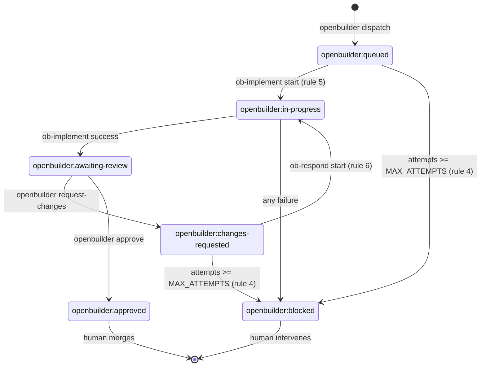
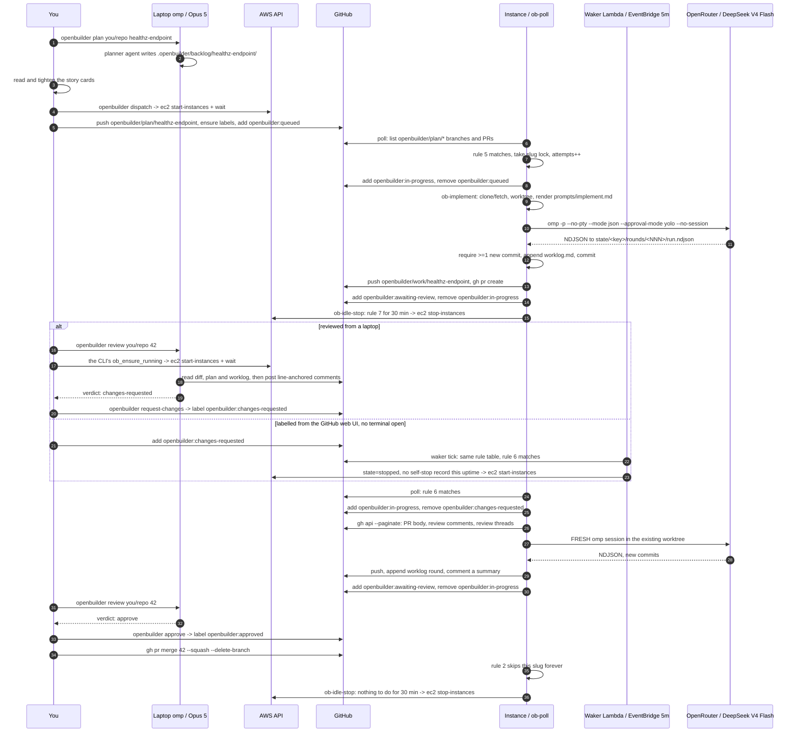

# Architecture

## 1. Component inventory

### On your laptop

| Component | Path | What it is |
|---|---|---|
| `openbuilder` CLI | `local/bin/openbuilder` | Bash. The only thing you type. Reads `OPENBUILDER_INSTANCE_ID`, `OPENBUILDER_REGION`, `OPENBUILDER_AWS_PROFILE`, `OPENBUILDER_TARGET_REPO`, sourcing `.openbuilder.local` if present. Ignores ambient `AWS_REGION`/`AWS_PROFILE` for instance calls so the local model provider's account cannot be targeted by mistake. Subcommands: `plan`, `dispatch`, `review`, `approve`, `request-changes`, `status`, `logs`, `shell`, `doctor`, `start`, `stop`, `cost`. |
| `Makefile` | `Makefile` | Wrappers for the one-time setup and the observation commands: `help` (default), `init`, `plan-tf`, `apply`, `destroy`, `secrets`, `doctor`, `shell`, `logs`, `status`, `fmt`, `lint`, `scrub`, `repo-create`. |
| planner agent | `agent/local/agents/planner.md` | Opus 5. Emits story cards per `backlog/SCHEMA.md`. |
| reviewer agent | `agent/local/agents/reviewer.md` | Opus 5. Emits `approve` or `changes-requested` plus line-anchored comments. Read-only tools plus `github` and `bash`. |
| skills | `agent/local/agents/skills/write-backlog/`, `.../review-openbuilder-pr/` | How to slice work; the review rubric and the exact `gh` commands. |

Every remote call from the laptop goes through `aws ssm send-command` (document `AWS-RunShellScript`) or
`aws ssm start-session`. There is never an SSH connection, because there is no SSH daemon reachable and no
key pair in the design at all.

### On GitHub (the message bus)

| Artifact | Name | Written by |
|---|---|---|
| plan branch | `openbuilder/plan/<slug>` | laptop (`dispatch`) |
| work branch | `openbuilder/work/<slug>` | instance (`ob-implement`) |
| story cards | `.openbuilder/backlog/<slug>/plan.md`, `story-<NN>-<name>.md` | laptop, committed on the plan branch |
| worklog | `.openbuilder/backlog/<slug>/worklog.md` | instance, committed on the work branch, appended once per round |
| pull request | head `openbuilder/work/<slug>` | instance |
| labels | `openbuilder:queued`, `:in-progress`, `:awaiting-review`, `:changes-requested`, `:approved`, `:blocked` | both |

`<slug>` matches `^[a-z0-9][a-z0-9-]{1,48}$`. There is no other channel. No webhook endpoint, no queue,
no database — if it is not a branch, a commit, a comment or a label, it does not exist.

### On the instance

| Component | Path | What it is |
|---|---|---|
| `ob-poll` | `/opt/openbuilder/bin/ob-poll` | The clock. Runs the §2 state machine. Emits one `DECISION repo=<r> slug=<s> rule=<n> action=<implement\|respond\|block\|skip> reason=<...>` line per slug plus a final `ACTIONABLE=<n>`, to the journal. `--dry-run` prints those decisions and takes no action. Global `poll` lock so passes never overlap. Ensures the six labels exist once per pass. |
| `ob-implement` | `/opt/openbuilder/bin/ob-implement` | `<owner/repo> <slug>`. Clone/fetch to `src/`, branch off the plan branch's merge-base with the default branch, create the worktree, read every `story-*.md` in slug order, copy the epic's `intake.md`, `prd.md` and `rfc.md` onto the work branch as `docs(epic): PRD and RFC for <epic>` when their content differs, render `prompts/implement.md`, run omp, require ≥1 new commit, append to `worklog.md`, push, `gh pr create`. |
| `ob-respond` | `/opt/openbuilder/bin/ob-respond` | `<owner/repo> <slug> <pr>`. Pull the PR body, review comments and review threads via `gh api --paginate`, render `prompts/respond.md`, run a **fresh** omp session in the existing worktree, require ≥1 new commit, append the round to `worklog.md`, push, comment. |
| `ob-idle-stop` | `/opt/openbuilder/bin/ob-idle-stop` | Stops the instance when no lock is held, `ob-poll --dry-run` reports no actionable work, and the newest mtime across `state/` and the log is older than `OPENBUILDER_IDLE_STOP_MINUTES`. Immediately before the stop it publishes its own verdict to `<ssm_prefix>/state/last_stop` in Parameter Store, best effort, for the waker's flap guard. |
| `ob-token` | `/opt/openbuilder/bin/ob-token` | Mints a GitHub App installation access token: RS256 JWT via `openssl dgst -sha256 -sign`, `iat = now-60`, `exp = now+540`, POST to `/app/installations/<id>/access_tokens`. Caches at `cache/gh-token.json` (0600), reuses while >5 min from `expires_at`. |
| `ob-doctor` | `/opt/openbuilder/bin/ob-doctor` | Preflight PASS/FAIL table. Non-zero exit on any FAIL. |
| `ob-selfupdate` | `/opt/openbuilder/bin/ob-selfupdate` | `git -C /opt/openbuilder/repo pull --ff-only` then re-run `bootstrap.sh`. |
| `ob-common.sh` | `/opt/openbuilder/bin/ob-common.sh` | Sourced library: logging, locking, SSM reads, slug keys, attempt counters, `gh` wrapper, label add/remove, the verified omp invocation, NDJSON text and cost extraction, secret redaction. |
| systemd | `openbuilder-poll.timer` (60s), `openbuilder-idle.timer` (5m) | `Type=oneshot` services running as `User=openbuilder` with `EnvironmentFile=/opt/openbuilder/etc/openbuilder.env`. |
| omp | `/usr/local/bin/omp` | Self-contained bun binary, `omp-linux-arm64`, checksum-verified against `SHA256SUMS.txt`. |
| implementer agent | `/opt/openbuilder/agent/agents/implementer.md` | Tools `read,grep,glob,write,edit,bash,lsp,todo,task,github,yield`. No `browser`, no `web_search`. |

### Instance filesystem

```
/opt/openbuilder                                 OPENBUILDER_HOME, home of the openbuilder system user
/opt/openbuilder/bin/                            runner scripts
/opt/openbuilder/prompts/                        implement.md, respond.md
/opt/openbuilder/agent/                          omp config.yml + agents/
/opt/openbuilder/etc/openbuilder.env             non-secret config, rendered by cloud-init
/opt/openbuilder/repo/                           checkout of this control repo (self-update source)
/opt/openbuilder/LEARNINGS.md                    fallback copy of the control repo's LEARNINGS.md (§3)
/opt/openbuilder/src/<owner>__<repo>/            git clone of a target repo
/opt/openbuilder/work/<owner>__<repo>__<slug>/   git worktree for one story set
/opt/openbuilder/state/<owner>__<repo>__<slug>/               attempts counter, blocked-reported marker
/opt/openbuilder/state/<owner>__<repo>__<slug>/rounds/<NNN>/  per-round forensics: prompt.md, run.ndjson,
                                                              final.md, feedback.md, pr-body.md,
                                                              learnings.md, learnings-proposed.md
/opt/openbuilder/log/openbuilder.log             append-only operational log
/opt/openbuilder/run/                            lockfiles
/opt/openbuilder/cache/gh-token.json             cached installation token, mode 0600
```

### In Lambda (the waker)

| Component | Path | What it is |
|---|---|---|
| `openbuilder-waker` | `waker/handler.py` | The power-on half of the loop. python3.13 on arm64, 256 MB, 30 s timeout, no VPC attachment, no layer. Reads `github_app_id`, `github_app_installation_id` and `github_app_private_key` from SSM — plus `state/last_stop` when it reaches the flap guard — mints an installation token, evaluates the §2 rule table against every repo in `var.repos`, and calls `ec2:StartInstances` when — and only when — at least one slug is actionable **and** the instance state is exactly `stopped`. Emits one `DECISION repo=<r> slug=<s> rule=<n> actionable=<bool> reason=<...>` line per slug, deliberately shaped like `ob-poll`'s, then the JSON result. |
| the predicate | `waker/github.py` | GitHub App auth plus `decide()`, the "is there work?" rule evaluation. Standard library only, and it imports no AWS SDK, so the whole decision path can be exercised off-Lambda against live GitHub with a local PEM. |
| RS256 | `waker/rs256.py` | RSASSA-PKCS1-v1_5 over SHA-256 with nothing but the standard library: PEM/DER parse to `(n, d)` accepting PKCS#1 and PKCS#8, the RFC 8017 §9.2 pad, one `pow()`. Signing only. The instance-side equivalent is `openssl dgst -sha256 -sign` inside `ob-token`. |
| schedule and IAM | `infra/waker.tf` | EventBridge rule `rate(<waker_interval_minutes> minutes)` — 5 by default — `ENABLED`/`DISABLED` from `waker_enabled`, its Lambda target and invoke permission, the function's role and inline policy, and the log group `/aws/lambda/openbuilder-waker` at `waker_log_retention_days` (14). The deployment zip is built by `hashicorp/archive`'s `archive_file` at plan time, so there is no build step. |

The waker's inputs are three SSM parameters, `state/last_stop` and `var.repos`. Its single side effect is
`ec2:StartInstances`. **It never stops the instance.** Power-off stays with `ob-idle-stop`, which is the
only party that can see whether a lock is held or a job is mid-flight; the waker sees GitHub and an
instance state, and nothing else. That asymmetry is what keeps the two halves of the loop from fighting
over the power button.

`ob_ensure_running` in the laptop CLI is unchanged and still starts the instance for interactive commands.
The waker makes the laptop unnecessary for the loop to close, not redundant: before it, a review submitted
from the GitHub web UI stalled until somebody opened a terminal.

### On AWS

One VPC, one internet gateway, **one public subnet** with `map_public_ip_on_launch = true`, one route
table, and a security group with **zero ingress rules** and egress-all. One IAM role and instance
profile with `AmazonSSMManagedInstanceCore` plus an inline policy for the four SSM parameters,
`ssm:PutParameter` on `<ssm_prefix>/state/*` and nothing wider, `kms:Decrypt` on `alias/aws/ssm` (via a
`kms:ViaService` condition), tag-conditioned `ec2:StopInstances`, read-only
`ec2:DescribeInstances`/`ec2:DescribeTags`, and `cloudwatch:PutMetricData` scoped to the `OpenBuilder`
namespace. Four SSM parameters under `/openbuilder`, plus `/openbuilder/state/last_stop`, which the
instance itself creates at its first self-stop rather than Terraform. One `t4g.medium` instance with
`http_tokens = "required"` and an encrypted 40 GB gp3 root volume. One optional monthly cost budget.

Outside the VPC: one Lambda function, its role and inline policy, its log group, one EventBridge scheduled
rule, that rule's target, and the `lambda:InvokeFunction` permission — seven resources, no NAT, no
interface endpoint, no API Gateway. The function is deliberately not attached to the VPC, because
everything it talks to (SSM, KMS, EC2, `api.github.com`) is a public endpoint and a VPC-attached Lambda
would need exactly the paid plumbing the instance's public subnet already refuses to buy.

Every resource is tagged `openbuilder:managed = "true"`, `Project = "openbuilder"`,
`Name = "<name_prefix>-<resource>"`.

### Environment contract

`/opt/openbuilder/etc/openbuilder.env` is rendered once by cloud-init from Terraform variables and
sourced by every runner script. The names are frozen:

```
OPENBUILDER_HOME, OPENBUILDER_SSM_PREFIX, OPENBUILDER_REPOS, OPENBUILDER_CONTROL_REPO,
OPENBUILDER_GH_HOST, OPENBUILDER_MODEL, OPENBUILDER_SMOL_MODEL, OPENBUILDER_MAX_RUNTIME,
OPENBUILDER_MAX_ATTEMPTS, OPENBUILDER_IDLE_STOP_MINUTES, OPENBUILDER_BRANCH_PREFIX,
OPENBUILDER_LABEL_PREFIX, OPENBUILDER_GIT_USER_NAME, OPENBUILDER_GIT_USER_EMAIL,
AWS_REGION, PI_CODING_AGENT_DIR
```

No secret is ever written to it. `ob-common.sh` fetches secrets with
`aws ssm get-parameter --with-decryption` at job start and exports them into the omp child process only.

The waker has a separate contract and never reads `openbuilder.env`, because it does not run on the
instance. Terraform renders its Lambda environment instead: `OPENBUILDER_SSM_PREFIX`, `OPENBUILDER_REPOS`,
`OPENBUILDER_INSTANCE_ID`, `OPENBUILDER_BRANCH_PREFIX`, `OPENBUILDER_LABEL_PREFIX` and
`OPENBUILDER_FLAP_GUARD_MINUTES`. It receives no secret either — it reads the three GitHub App parameters
itself, with `WithDecryption`, on every invocation, and `<ssm_prefix>/state/last_stop`, which holds nothing
secret, only when the flap guard needs it. The branch and label prefixes are the literal
`openbuilder` in both places (cloud-init and `waker.tf`) and they must agree: those two strings are the
wire format of the message bus.

## 2. The state machine

`ob-poll` fires every 60 seconds. For each `owner/repo` in `OPENBUILDER_REPOS`, for each remote branch
matching `openbuilder/plan/*`, it derives `<slug>` and evaluates these rules **in order — first match
wins, one action per poll pass**:

| # | Condition | Action |
|---|---|---|
| 1 | a lock for this slug is held | skip (a job is already running) |
| 2 | PR exists and has label `openbuilder:approved` | skip forever |
| 3 | PR exists and has label `openbuilder:blocked` | skip forever |
| 4 | attempts counter ≥ `OPENBUILDER_MAX_ATTEMPTS` | label `openbuilder:blocked`, comment why, skip |
| 5 | no PR with head `openbuilder/work/<slug>` exists | `ob-implement <owner/repo> <slug>` |
| 6 | PR exists and has label `openbuilder:changes-requested` | `ob-respond <owner/repo> <slug> <pr>` |
| 7 | otherwise | skip (waiting on the human reviewer) |

The ordering is the whole design. Rules 1–4 are refusals and they come first, so no amount of label
weirdness or leftover state can make the instance act on a slug a human has closed out. Rule 7 is the resting
state: the common case for a live PR is "do nothing, the reviewer has it".

### Parity contract — `ob-poll` and `waker/github.py`

The instance is off most of the time, so something outside it has to evaluate this same table to know
whether powering it on is worth $0.0384/h. That something is the waker, and it therefore implements the
table a second time, in Python (`waker/github.py:decide`), against the same GitHub state:

| # | `ob-poll`, on the instance | `waker/github.py`, in Lambda |
|---|---|---|
| 1 | lock held → skip | **invisible** — the lockfile is instance-local |
| 2 | `openbuilder:approved` → skip forever | same verdict: not actionable |
| 3 | `openbuilder:blocked` on the PR → skip forever | same verdict: not actionable |
| 4 | attempts ≥ `MAX_ATTEMPTS` → label `blocked`, comment, skip | **invisible** — the counter lives in `state/`; covered by its side effect |
| 5 | no PR with head `openbuilder/work/<slug>` → implement | same verdict: actionable |
| 6 | `openbuilder:changes-requested` → respond | same verdict: actionable |
| 7 | otherwise → skip | same verdict: not actionable — the resting state |

Rules 1 and 4 read instance-local state — a lockfile under `run/`, an attempts counter under `state/` — and
no amount of GitHub reading recovers them. Rule 1 does not matter: if a lock is held the instance is
running, and the waker only ever starts a `stopped` one. Rule 4 matters enormously, and it is covered by
its *observable side effect* instead of its state.

**This is what makes `openbuilder:blocked` load-bearing.** When the attempt budget is exhausted the
instance labels the PR `openbuilder:blocked` — and when there is no PR, because an implement round that
failed `MAX_ATTEMPTS` times never opened one, it opens a tracking issue titled `openbuilder blocked: <slug>`
and labels that instead. The waker checks both forms: `work_pr` for the label, `blocked_slugs` for the open
issue. Without the no-PR form, a slug that can never produce a PR would match rule 5 on every tick — no PR
implies actionable — and wake the instance every five minutes, forever, for a job guaranteed to fail again.
The label and the tracking issue are not bookkeeping; they are the termination condition of the outer loop.

**Changing the rules obliges two edits.** Add, reorder or retire a rule in `ob-poll` and you must make the
matching change in `waker/github.py:decide` in the same commit. Forgetting produces no error: the instance
boots for work it then refuses to do (waker too permissive) or a labelled PR sits untouched until somebody
opens a terminal (waker too strict). Both are silent, which is why the `rule` number is on every verdict —
`ob-poll` logs `DECISION ... rule=<n> action=<...>`, the waker logs `DECISION ... rule=<n> actionable=<...>`,
and for the same slug the two rule numbers must agree.

### The flap guard — second line of defence

The blocked label is the first line of defence against a wake loop, and it depends on the instance
behaving correctly. The flap guard does not. Before starting anything, the waker requires **two** things to
hold together, and refuses only when both do:

1. the instance's `LaunchTime` is less than `waker_flap_guard_minutes` (20) ago, **and**
2. `ob-idle-stop` left a record that it stopped *this* uptime because it found no work.

It logs the refusal loudly, returns `outcome: flap-guard` carrying `minutes_since_launch` and
`self_stopped_at`, and takes no action at all.

**Condition 1 used to be the whole guard, and it accused the wrong party.** `ob-idle-stop` requires
`idle_stop_minutes` (30) of no held lock, no actionable work and no filesystem activity before it stops, so
the shortest *legitimate* on→off cycle is 30 minutes — from which the old guard concluded that a young
launch on an already-`stopped` instance meant the instance and the waker disagreed about whether work
existed. It does not follow. Elapsed time cannot tell "I stopped myself after finding no work" apart from
"a human stopped me", and only the first is a fault. Observed for real on 2026-08-09: an operator started
the box by hand for an unrelated test and stopped it two minutes later, and a genuinely queued story then
sat unstarted for the full twenty minutes while the waker refused it on every five-minute tick — at 6.5
minutes, again at 11.5, and so on.

**So the party that made the decision records its own verdict**, instead of leaving the waker to infer it
from a clock every actor shares. Immediately *before* calling `ec2:StopInstances`, `ob-idle-stop` writes a
String parameter at `<ssm_prefix>/state/last_stop`:

```
{"instance":"i-0123456789abcdef0","at":"2026-08-09T11:05:03Z","actionable":0,"quiet_minutes":30,"by":"ob-idle-stop"}
```

That write is **best effort by design**: failing to publish it must never keep a paid instance running.
`ob-idle-stop` logs `recorded the stop verdict at /openbuilder/state/last_stop` on success, or
`could not write /openbuilder/state/last_stop; the flap guard has nothing to fire on, so the waker may
start this instance again as soon as work appears` on failure, and stops either way.

**Not knowing resolves in favour of starting.** `_last_stop_verdict()` returns `None` for every case where
the answer is unclear — no record yet, malformed JSON, `actionable` not zero, any `ClientError` — and the
guard reads `None` as "no disagreement observed" and starts the instance. It also requires the record to be
*newer* than the current `LaunchTime`, so one left behind by an earlier uptime does not fire it. The
asymmetry is deliberate: a needless start costs cents, a stranded backlog costs the whole point of the
system.

Condition 1 still carries the bound it always did, so `waker_flap_guard_minutes` must stay strictly below
`idle_stop_minutes`. At or above it the guard would fire on legitimate cycles — which are exactly the
cycles that write the record — and refuse real work, silently, which is the failure mode it exists to
prevent. At 20 against 30 it keeps a 10-minute margin for the 5-minute granularity of
`openbuilder-idle.timer` and for boot time.

**The instance's `ssm:PutParameter` grant covers `<ssm_prefix>/state/*` and deliberately not
`<ssm_prefix>/*`.** It reads its OpenRouter key and GitHub App PEM from that same prefix, and an instance
able to overwrite the credentials it reads is one bad round away from a far worse day than a wake loop. The
waker's read was already path-scoped to `<ssm_prefix>/*`, so it covers `state/last_stop` with no widening;
only the instance writes under `state/`.

One operator-visible consequence: a manual `aws ec2 stop-instances` or `openbuilder stop` no longer creates
a twenty-minute blind spot. No self-stop record is written for it, so the waker starts the box again within
`waker_interval_minutes` if GitHub has work. To keep it off regardless, set `waker_enabled = false`.

### Label transitions performed by the instance

| Event | Add | Remove |
|---|---|---|
| `ob-implement` start | `openbuilder:in-progress` | `openbuilder:queued` |
| `ob-implement` success | `openbuilder:awaiting-review` | `openbuilder:in-progress` |
| `ob-respond` start | `openbuilder:in-progress` | `openbuilder:changes-requested` |
| `ob-respond` success | `openbuilder:awaiting-review` | `openbuilder:in-progress` |
| any failure | `openbuilder:blocked` | `openbuilder:in-progress` |

Failure always also posts a PR comment with the log tail. There is no silent failure mode: a job either
advances the labels or leaves a `openbuilder:blocked` label and an explanation.

### Label state diagram



## 3. The learnings store

There are two kinds of memory in this design, and confusing them is the main way to get this wrong.

| Store | Lives in | Scope | Written by |
|---|---|---|---|
| `.openbuilder/backlog/<slug>/worklog.md` | the **target** repo, on the work branch | one slug: decisions taken, dead ends, deviations from a card, what was left undone | the agent, every round, plus an automatic round summary |
| `LEARNINGS.md` | the root of the **control** repo | every round, every target repo, every machine | a human, by commit |

The split is a rule, not a taste. "This service's retry helper is called `withBackoff`" is repo-specific and
belongs in the worklog; "a probe must fail for exactly one reason" is true everywhere and belongs in
`LEARNINGS.md`. Entries there have a fixed shape — **Symptom / Cause / Rule / Proven** — under two headings,
"Rules the implementer must follow" and "Environment truths", and the file carries its own admission criteria
at the top, because a store with no stated criteria fills up with plausible advice and then stops being read.

### Why the control repo

Not the instance, because the instance is disposable and its disk is not durable. An EBS root volume cannot
follow its instance to another availability zone, so moving the box — `eu-central-1a` to `eu-central-1b`, done
on 2026-08-09 — destroys the volume and everything only that volume knew. Any store under `/opt/openbuilder`
is one rebuild away from empty.

Not a chat log either. Every round is a fresh `--no-session` process (§5), so there is no conversation to
carry forward, and a transcript is the wrong shape anyway: nobody re-reads six rounds of tool calls to find
the one sentence that mattered. The control repository is the only artifact in the design that is versioned,
diffable, reviewed, off-box, and already read by every round on every machine. So the store is a file in it,
and adding an entry is a commit with a message.

### How it reaches the implementer — `ob_learnings`

`ob_learnings <out-file>` in `ob-common.sh` takes the first of four sources that yields a non-empty file:

| # | Source | What it logs |
|---|---|---|
| 1 | the control repo's **remote** — `git fetch origin HEAD`, then `git show FETCH_HEAD:LEARNINGS.md` | `INFO learnings: <n> lines from <control-repo> (remote)` |
| 2 | the local clone at `/opt/openbuilder/repo` — `git show HEAD:LEARNINGS.md` | `WARN ... remote unreachable; using the local clone at <sha>` |
| 3 | the copy `bootstrap.sh` installed at `/opt/openbuilder/LEARNINGS.md` | `WARN ... using the installed copy at ...` |
| 4 | nothing — the out-file is left empty | `WARN ... none found; this round runs without them` |

Step 4 is why the chain exists at all: a missing learnings file **degrades** a round, it never fails one.
Nothing about fetching a documentation file is worth failing an implementation over. Every step below the
first says so at WARN, so the degradation is visible afterwards instead of silent.

**Remote first, because publishing must be one push.** Steps 2 and 3 are both snapshots of a past deploy: the
local clone only moves when `ob-selfupdate` runs, and the installed copy only moves when `bootstrap.sh`
re-runs. Reading either of them first would make a new learning wait on a code deploy — and a learning is at
its most valuable in the minutes after it was paid for. Reading the remote first makes the whole publication
path *edit one file, push*: the next round of every slug in every allowlisted repo has it, with no
`ob-selfupdate`, no restart and nothing to deploy.

**`fetch origin HEAD`, not a pull and not a shallow fetch.** `fetch origin HEAD` writes `FETCH_HEAD` and moves
no branch, so reading a learning cannot advance the code the instance is running: `ob-selfupdate` stays the
only thing that changes what executes. `--depth 1` would be cheaper and is forbidden, because it marks the
clone shallow permanently and `ob-selfupdate`'s `merge --ff-only` cannot fast-forward out of that — a
documentation fetch would have broken self-update. Nor can the two race: `ob-selfupdate` skips entirely while
any job lock is held, and `ob_learnings` only ever runs inside a job that holds one. Both reads pass
`-c safe.directory='*'`, so a clone whose ownership was disturbed by an earlier root-run `git` cannot quietly
demote the round to step 3.

### Injection, and the one writable path

`ob-implement` and `ob-respond` render two placeholders per round:

- `{{LEARNINGS}}` — a block placeholder, replaced by the resolved file verbatim under a `## Learnings` heading
  that tells the agent to read it first and treat every entry as a hard rule. "What to do" item 8 says the
  same from the other side: obey them, and when a learning and a story card genuinely conflict, stop and
  report the conflict rather than pick a winner.
- `{{LEARNINGS_OUT}}` — a scalar naming `state/<owner>__<repo>__<slug>/rounds/<NNN>/learnings-proposed.md`,
  which the wrapper truncates to empty before the round starts.

That second file is the **only** path outside the worktree a round may write (hard rule 7 in both prompts,
§6). The alternatives were no capture at all — the knowledge dies with the round that paid for it — or a
writable directory, which is a foothold in the control plane for a model running `--approval-mode yolo`. One
named file avoids both, and it is cheap for four reasons: the wrapper names it, so nothing has to be
discovered or guessed; it is per-round, so it cannot accumulate; it starts empty, so whatever is in it is
unambiguously this round's; and it is not code — nothing sources it, executes it, or configures anything from
it. It is `cat`-ed into a markdown document and read by a human. Its worst case is noise in a pull request.

### Cheap to propose, deliberate to accept

Capture is asymmetric on purpose. Proposing costs the agent one append and no ceremony — the prompt does not
even ask it to number the entry — and the four tests a candidate must pass are stated rather than enforced: it
would have changed how the round worked had it been known at the start, it is true beyond this repository and
this story, it was actually observed with a symptom that can be quoted, and it is not already an entry. The
prompt also says most rounds should leave the file empty, so an empty file is a correct outcome rather than a
missed one.

Acceptance is the expensive side. `ob_learnings_proposed` counts any non-blank line as a proposal; when there
is one, the round appends a **Learnings proposed this round** section to the slug's `worklog.md` and commits
it on the work branch, so it arrives in the pull request the reviewer is already reading. A human — or the
reviewer acting for one — copies the entry into `LEARNINGS.md` and pushes. Nothing the agent writes takes
effect on its own.

That asymmetry mirrors an asymmetry in cost. A missed learning is bounded: you pay for it a second time and
write it down then. A wrong learning is not, because `LEARNINGS.md` is injected verbatim into every future
round of every repository — one confident, wrong imperative degrades all of them at once, and no test can
catch it, because it is prose. So the write path is free and the commit path goes through the review gate that
already exists.

**The gate itself had to be exercised.** An earlier `ob_learnings_proposed` skipped lines beginning with `#`,
treating them as comments — and the entry shape the prompt asks for is a markdown heading, `### N. rule`. It
therefore discarded every real proposal and logged nothing, in a code path whose most common *correct* outcome
is "nothing proposed". That is a bug with no symptom, and it was found by running the gate against a real
proposal on the instance rather than by reading it.

## 4. One full cycle



Instance power moves on three arrows with three different owners: the laptop CLI starts it for interactive
commands (`dispatch`, `review`, `request-changes`, `shell`, `doctor`, `cost`), the waker starts it when
GitHub has work and nobody has a terminal open, and `ob-idle-stop` stops it — twice here, once while the
reviewer has the PR and once after the merge. Nothing but the instance ever stops the instance. Every arrow
leaving `U` is a human decision — plan, tighten the cards, review, merge — and the whole right-hand branch
of that `alt` runs whether or not a laptop is open.

## 5. Design decisions

Each of these was a real fork in the road. The tradeoff is named, not hidden.

### Poll loop instead of webhooks

`ob-poll` on a 60-second systemd timer, not a GitHub webhook.

A webhook would need an inbound path to the instance: a public listener, an ALB or API Gateway plus Lambda,
a TLS certificate, a webhook secret to rotate, and a security group with an ingress rule. That is four
more resources, one more secret and an internet-reachable endpoint — to save at most 60 seconds of
latency on a job that takes minutes. Polling needs nothing inbound at all: the instance makes outbound HTTPS
calls to `api.github.com` and that is the entire network surface.

The waker is the same argument applied to power-on: a scheduled pull, not a pushed event. EventBridge
invokes it on a timer, it makes outbound calls to SSM, KMS, EC2 and `api.github.com`, and there is still no
inbound path to anything in this design. A webhook would have had to terminate somewhere reachable from
the internet; `rate(5 minutes)` terminates nowhere.

**Tradeoff:** up to 60 seconds of latency before a plan branch is noticed, and a steady trickle of `gh`
API calls even when idle. Both are irrelevant at this scale; the API calls stay far inside the
authenticated rate limit, and the idle poll is exactly what lets `ob-idle-stop` be confident there is no
work pending.

### A scheduled Lambda for power-on instead of the laptop or an always-on instance

`ob-idle-stop` gave the instance an off switch long before anything could turn it back on. The only
power-on path was `ob_ensure_running` in the laptop CLI, which made the loop's autonomy conditional on a
human having a terminal open: label a PR `openbuilder:changes-requested` from the GitHub web UI and
nothing at all happened until you got back to a laptop.

The alternatives were to leave the instance running (~$35.48/month for a machine that is idle most of the
day, against a $3.80/month floor while stopped), to make the laptop a scheduled participant (a cron job on
a machine that is closed, asleep, or on a different network), or to accept a webhook and the inbound
surface it needs. A 256 MB function on an EventBridge timer is none of those: a scheduled rule is free and
~8.6k invocations a month at 256 MB sits far inside the perpetual Lambda free tier, so the power-on half of
the loop costs $0.

**Tradeoff:** the §2 rule table now exists twice, once in Bash on the instance and once in Python in
Lambda, and the two can drift. That is a genuine maintenance cost, and it is why the parity contract is
written down next to the table rather than left to be rediscovered. The second cost is latency: up to
`waker_interval_minutes` (5) between labelling a PR and the instance beginning to boot, plus the ~30–45 s a
start takes. On a job measured in minutes, that is noise.

### Public subnet instead of a NAT gateway or interface endpoints

One public subnet, `map_public_ip_on_launch = true`, zero ingress rules.

The instance needs outbound 443 to `api.github.com`, `openrouter.ai`, the Ubuntu and NodeSource mirrors, and
the AWS SSM/EC2/KMS endpoints. The two "private" alternatives both cost real money: a NAT gateway is
~$32/month plus data processing, and the interface endpoints needed for Session Manager
(`ssm`, `ssmmessages`, `ec2messages`) run ~$22/month combined. Together that is roughly $54/month of
approximate spend — more than doubling the bill of a ~$25/month instance — to hide a host that already
accepts zero inbound connections.

**Tradeoff:** the instance has a public IPv4 address. That is a real exposure increase on paper, which is
why the security group has *no* ingress rules whatsoever (not "SSH from my IP" — none), there is no
sshd-reachable port, and there is no key pair. An unsolicited packet has nothing to reach. The public IP
also costs ~$3.65/month if the instance runs continuously, now that AWS charges for in-use IPv4 addresses —
still an order of magnitude cheaper than the alternative, and it stops when the instance does.

### GitHub App instead of a personal access token

A GitHub App (`openbuilder-bot`) whose installation token `ob-token` mints on demand.

A PAT is a long-lived bearer credential sitting on a instance that runs a model with shell access. An App
installation token expires in one hour, is scoped to the repositories you explicitly installed the App
on, and cannot be broadened from the instance. It also gives the bot its own identity: every commit, PR and
comment is visibly `openbuilder-bot`, so `git log` and the PR timeline tell you exactly which changes
were machine-authored, and you can revoke the whole thing by uninstalling one App.

**Tradeoff:** more setup. You have to create an App, install it, download a PEM, and implement JWT
signing (`ob-token`, ~60 lines of `openssl` and `jq`) instead of pasting one token into SSM. That
complexity is paid once, at setup, by you — not repeatedly, at runtime, by your threat model.

### Zero dependencies in the waker instead of a layer or a container image

`waker/rs256.py` implements RSASSA-PKCS1-v1_5 over SHA-256 with the standard library, and the whole
function is three `.py` files.

The Lambda runtime ships boto3 and nothing else that helps: no `cryptography`, no `PyJWT`. Signing an App
JWT therefore needed either a dependency — which in Lambda means a layer to build, version and attach, or
a container image to build, push to ECR and keep patched — or the primitive itself. The primitive turned
out to be smaller than its packaging: strip the PEM armour, parse the DER to `(n, d)` (accepting both
PKCS#1 `BEGIN RSA PRIVATE KEY` and PKCS#8 `BEGIN PRIVATE KEY`, because anything round-tripped through
OpenSSL 3 comes back as the latter), prepend the constant SHA-256 `DigestInfo` prefix, pad per RFC 8017
§9.2, and call `pow()` once. The payoff is that there is no build step anywhere in the deploy path —
`archive_file` zips a directory — and nothing to rebuild when a base image moves. The instance side has the
same shape for the same reason: `ob-token` is `openssl dgst` and `jq`.

The split matters as much as the crypto. `waker/github.py` imports no AWS SDK and `handler.py` holds every
boto3 call, so token minting, the GitHub reads and `decide()` run on a laptop against live GitHub with a
local PEM. That is how the predicate was actually verified — rule 5 with a plan branch and no PR, rule 7
with an unlabelled PR, rule 6 with `changes-requested`, rule 2 beating rule 6, and rule 4's no-PR form with
an open `openbuilder blocked: <slug>` issue. A predicate you can only exercise by deploying is a predicate
you will not exercise.

**Tradeoff:** hand-written crypto, which is normally the wrong answer. It is defensible here on three
counts. Only *signing* is implemented — verification, where a bug becomes a vulnerability, stays GitHub's
problem. The output is checkable against a reference implementation, and was: `rs256.sign` verified with
`openssl dgst -sha256 -verify`, and the PKCS#1 and PKCS#8 encodings of one key parsing to identical
`(n, d)`. And the failure mode is immediate and total rather than subtle — a bad signature means GitHub
rejects the JWT and nothing ever wakes.

### Fresh session plus a worklog instead of resuming the omp session

Every round — the initial implement and each response to review — is a brand-new omp process with
`--no-session`. Continuity lives in `.openbuilder/backlog/<slug>/worklog.md`, committed on the work
branch.

Resuming a session sounds cheaper and smarter. In practice a long-running agent session degrades: early
wrong turns stay in context and keep being treated as decisions, the transcript fills with tool noise,
and by round four the model is reasoning about its own confusion rather than the code. A fresh session
reads the current diff, the story cards and a human-readable worklog — the actual state of the world,
with the dead ends summarised rather than replayed. It is also auditable: the worklog is a file in the
PR that you can read, and it is the first thing to look at when the agent goes sideways.

**Tradeoff:** you pay input tokens to re-read context every round instead of reusing a warm session, and
the model can repeat a mistake the worklog failed to record. At $0.09/Mtok input that is cents, and it
makes worklog discipline a load-bearing instruction in the implementer prompt rather than a nicety.

The worklog is the per-slug half of the design's memory. The cross-repo half is `LEARNINGS.md` in the control
repository, injected into the same prompt from the same fresh session (§3).

### Always-on with idle auto-stop instead of ephemeral instances

One long-lived instance that stops itself after `OPENBUILDER_IDLE_STOP_MINUTES` of nothing to do, rather
than launching a fresh instance (or container) per job and terminating it.

An ephemeral instance starts from zero every time: full `apt-get`, a Node install, an omp download, a cold
`git clone` of the target repo, and a cold dependency install before the model writes a single line. On
a `t4g.medium` that is minutes of paid setup per job, repeated. The persistent instance keeps
`/opt/openbuilder/src/<owner>__<repo>/` as a warm clone that only needs a `git fetch`, keeps the package
manager cache, and keeps `git worktree` directories around so a review round starts instantly.

With the waker in front of it, `stopped` is the resting state rather than a state only a human can leave:
the instance is off unless GitHub has work. The floor is not zero, though. The 40 GiB gp3 root volume bills
whether the instance runs or not (~$3.80/month), and getting to $0 would mean terminating the instance and
throwing away the warm clone and its dependency caches in exchange for a 2–4 minute cold start on the next
job.

**Tradeoff:** state accumulates, and state rots. Stale worktrees, a growing `state/` directory and a
disk that can fill are real failure modes — see the runbook. In exchange, `ob-idle-stop` gets you most
of the ephemeral cost profile anyway (~$8/mo of compute instead of ~$25), and every script is written to
be idempotent precisely because it will run on a dirty machine.

### A cheap model remotely, Opus 5 as the local gate

DeepSeek V4 Flash implements; Opus 5 plans and reviews.

The remote model's job is mechanical: read explicit story cards, edit the named files, run the repo's own
tests, commit. That is the part where throughput and cost matter and where a 1M-token context at
$0.09/Mtok is transformative. Judgement — deciding what to build, and deciding whether what came back is
acceptable — is where a weak model is genuinely dangerous, and that stays on your laptop with the
expensive model and a human in the loop. The economic asymmetry is roughly two orders of magnitude, so
spending Opus tokens on review and DeepSeek tokens on typing is the right allocation.

**Tradeoff:** the weak model produces worse first drafts and needs more review rounds. That is exactly
what `OPENBUILDER_MAX_ATTEMPTS` and the `openbuilder:blocked` label are for — the system is designed to
give up loudly rather than to grind. Story-card quality carries the whole load: a vague card produces a
vague PR, and this is the design's real dependency on human effort.

### OpenRouter pay-per-use instead of an OpenCode Zen or Go subscription

The remote implementer stays on `openrouter/deepseek/deepseek-v4-flash-0731`, billed per token, rather than
on an OpenCode subscription.

**A switch would be configuration, not integration.** `omp` ships two built-in provider ids for exactly
this — `opencode-zen` and `opencode-go` — and its own `providers.md` provider/environment-variable table
shows both credentialed by `OPENCODE_API_KEY`. There is no custom `models.yml` provider to write, no
`baseUrl` to set and no build step: the work is one secret slot, one exported variable name and the model
strings.

The exact build we run is in the OpenCode Zen catalog twice. models.dev's `opencode` provider
(endpoint `https://opencode.ai/zen/v1`, OpenAI-compatible, package `@ai-sdk/openai-compatible`) carries:

| models.dev id | Model | Context | Output | $/Mtok in | $/Mtok out |
|---|---|---|---|---|---|
| `deepseek-v4-flash` | `deepseek/deepseek-v4-flash-0731` | 1,000,000 | 384,000 | $0.14 | $0.28 |
| `deepseek-v4-flash-free` | `deepseek/deepseek-v4-flash-0731` | 200,000 | 128,000 | $0.00 | $0.00 |

The comment in `agent/remote/config.yml` records OpenRouter's rate for the same model as $0.09 / $0.18 per
Mtok, so Zen's paid tier is ~1.55x OpenRouter per token and its free tier gives up 800k of context.

**Six coupling points**, all confirmed by reading the code:

- `infra/ssm.tf` — the secret slot, currently `openrouter_api_key`.
- `runner/bin/ob-common.sh`, ~line 670 — exports `OPENROUTER_API_KEY` into the omp child process.
- `agent/remote/config.yml` — four `modelRoles` entries plus `disabledProviders`.
- `infra/variables.tf` — the `model` / `smol_model` defaults rendered into cloud-init.
- `runner/bin/ob-doctor`, ~line 74 — the SSM parameter existence check.
- `runner/bin/ob-doctor`, ~line 140 — `probe_openrouter`, which asks the provider directly for its
  verbatim `.error.message`.

**The arithmetic does not favour a subscription yet.** One real story on 2026-08-09
(`artemkurylo/openbuilder#1`) cost $0.0663 for the implement round and $0.0335 for the review-response
round — ~$0.10 per story round-trip. A $10/month subscription therefore breaks even at ~100 stories/month
at OpenRouter's rate, or ~65 stories/month against Zen's pay-per-use rate. Below that it costs more, not
less.

**Three things are unverified, and they must be checked from the instance.** Whether the **Go**
subscription entitles `deepseek-v4-flash` specifically, and at what rate limits, is unknown: models.dev
lists Zen's 87-model catalog, and Go is a subscription-gated subset of it. Go's price ($5 first month, then
$10/month) is unverified too — it comes from search-result snippets, because the page itself could not be
fetched: the operator's corporate DNS resolves `opencode.ai` to an OpenDNS block page, and the same DNS
blocks `openrouter.ai` from that laptop. The instance has clean egress, so that is where to check. The
third unknown is the exact model-id string `omp` expects for the provider. One command settles the
entitlement and the string together, and it is the thing to run before touching any of the six points
above: `OPENCODE_API_KEY=... omp models opencode-go`.

**The failure modes differ in kind, and that is the actual decision.** Pay-per-use degrades on *billing*:
visible in AWS Budgets, visible at the provider, and already reported verbatim by `ob-doctor`'s
`probe_openrouter`. A subscription degrades on *rate*, and a 429 in the middle of a round is an unattended
failure at 3am — `ob-respond` fails loud, labels the slug `openbuilder:blocked` and parks it until a human
clears the label. Cheaper tokens are not worth trading a billing signal you watch for a rate signal you
discover in the morning.

**Tradeoff:** spend is variable and unbounded in principle, so a runaway loop lands on the budget instead
of on a throttle. Two things reverse this decision: wanting flat, predictable billing regardless of volume,
or sustained volume past the break-even above.

## 6. Security model

### What is enforced

- **No inbound network.** The security group has zero ingress rules. No SSH, no port 22, no key pair, no
  load balancer, no webhook listener. All access is `aws ssm start-session` / `aws ssm send-command`,
  which is an outbound-initiated connection from the instance to AWS.
- **IMDSv2 required.** `metadata_options { http_tokens = "required" }`. The instance metadata service
  cannot be read without a `PUT`-obtained token, which closes the classic SSRF-to-credentials path — the
  one thing that matters most on a instance running a model with shell and network access. `ob-idle-stop`
  obtains its own instance id the IMDSv2 way.
- **Secrets in SecureString, never on disk.** `openrouter_api_key` and `github_app_private_key` are SSM
  `SecureString` parameters. `/opt/openbuilder/etc/openbuilder.env` holds only non-secret configuration.
  Secrets are fetched with `--with-decryption` at job start and exported into the omp child process only.
  `ob-common.sh` redacts `sk-or-`, `ghs_`, `github_pat_` and `-----BEGIN` from everything it logs.
- **Encrypted volume.** The gp3 root volume is `encrypted = true`, `delete_on_termination = true`.
- **Least-privilege IAM.** The instance role can read exactly `<ssm_prefix>/*`, write exactly
  `<ssm_prefix>/state/*` — `state/last_stop` and no wider, so it can never overwrite the credentials it
  reads from the same prefix — decrypt only via `ssm.<region>.amazonaws.com` (`kms:ViaService`), put metrics
  only into the `OpenBuilder` namespace, and stop instances **only where
  `ec2:ResourceTag/openbuilder:managed = "true"`**. The self-stop permission is tag-scoped rather than
  ARN-scoped, so it survives instance replacement without ever letting the instance stop something it does
  not own. It has no `ec2:TerminateInstances`, no `iam:*`, no `s3:*`.
- **The waker role is the mirror image.** The same `<ssm_prefix>/*` read and the same
  `kms:ViaService`-conditioned `kms:Decrypt`, `ec2:DescribeInstances` for state and `LaunchTime`, and
  `logs:CreateLogStream`/`logs:PutLogEvents` on its own log group only — plus exactly one mutation:
  `ec2:StartInstances`, conditioned on the same `ec2:ResourceTag/openbuilder:managed = "true"`. The
  instance may stop and not start; the waker may start and not stop. **Neither may terminate.**
  `ec2:TerminateInstances` is granted to no principal in this design, and the guardrails hook additionally
  blocks `aws ec2 terminate-instances` as a command shape on the instance. The waker has no VPC
  attachment, no write access to Parameter Store — including under `state/`, which it only reads — and no
  shell for anything to get execution in. It reads the three GitHub App parameters plus `state/last_stop`,
  and never the OpenRouter key — though its path-scoped `ssm:GetParameter*` on `<ssm_prefix>/*` does cover
  it, which is the one place this policy is wider than the function's needs: splitting the prefix to
  exclude a single parameter buys nothing while the instance role can read it all.
- **Short-lived, narrowly-scoped GitHub credentials.** Installation tokens expire in an hour and only
  cover the repositories the App is installed on. The token cache is mode 0600 and is never logged.
- **The agent cannot merge or force-push.** By convention (the prompt says so) *and* by enforcement:
  `agent/hooks/pre/guardrails.ts` is a `tool_call` hook that blocks, with a reason string, `gh pr merge`,
  `git push --force`/`-f`, any `git push` targeting `main`/`master`, `git reset --hard` outside the
  worktree, `rm -rf /`, `aws ec2 terminate-instances`, and any write under `/opt/openbuilder/etc`.
  A blocked call returns `{ block: true, reason }` and the model sees the refusal.
- **Provider lockout.** `agent/remote/config.yml` sets `disabledProviders` for `amazon-bedrock`,
  `anthropic`, `openai`, `google`, `ollama`, `llama.cpp` and `lm-studio`, so a stray config or an
  environment variable cannot make the instance talk to a model you did not intend to pay for. The
  implementer agent's tool list excludes `browser` and `web_search`.
- **The agent may write in exactly one place outside its worktree.** Hard rule 7 in both prompts permits
  `{{LEARNINGS_OUT}}` — one per-round, non-code file the wrapper creates empty and names for it (§3) — and
  nothing else anywhere under `/opt/openbuilder`. The guardrails hook backs up the half of that which matters
  most: any write under `/opt/openbuilder/etc` is blocked outright.
- **No employer identifiers, by instruction and by check.** Hard rule 8 in both prompts forbids writing the
  name of a company, a client or an employer, an internal hostname, a cloud account number or a work email
  address into code, commits, comments or the final message — and says why: this repository is public *and*
  the round is processed by a third-party model, so such an identifier has left your control twice over the
  moment it is typed. A prompt is a request, so `local/bin/ob-scrub-check` is the mechanical half. It matches
  an extended-regex deny list against the tracked working tree (default), the index (`--staged`) or every
  commit reachable from `git rev-list --all` (`--history`), reports each hit as `path — N match(es)`, and
  exits 1. **The deny list is not in the repository**, because the patterns are themselves the sensitive
  part — a list of your employer's hostnames is precisely the file you must not publish. It comes from
  `$OPENBUILDER_SCRUB_DENY` or a gitignored `.scrub-deny` at the repo root; with neither present the tool
  prints how to create one and exits 0, so it never blocks a fresh clone. It never prints the matching text,
  only a path and a count, because a check that echoes the string it protects has leaked it to the terminal,
  the scrollback and eventually a log. On a hit it also states the real remedy: a match already in published
  history needs history rewritten, not just another commit. `make scrub` runs the worktree and history modes;
  `make lint` shellchecks `local/bin/*` along with the rest. Like the guardrails hook it is a denylist — it
  catches the identifiers you thought of, not the ones you did not.
- **Fail loud.** Every failure path exits non-zero, adds `openbuilder:blocked`, and posts a PR comment
  with the log tail. Attempts are counted and capped at `OPENBUILDER_MAX_ATTEMPTS`.
- **A human merges.** Nothing in the system can land code on a default branch. That is the last gate and
  it is not automatable by design.

### Residual risks — read these

The guardrails hook is **defense in depth, not a sandbox**. It is a denylist of specific dangerous
command shapes, and a denylist is defeatable by an adversarial or merely creative model: a different
spelling, an env var, a shell function, a script written to a file and then executed. Treat it as the
thing that stops accidents, not the thing that stops attacks.

Inside that qualification, the honest statement of exposure is:

1. **The instance holds a GitHub credential with write access to every allowlisted repo.** An installation
   token is short-lived but continuously renewable from the PEM in SSM, which the instance can read by design.
   Anything that gets code execution as `openbuilder` on that instance can push branches, open PRs and
   comment on any repo in `OPENBUILDER_REPOS` for as long as it has that access. **Keep `repos` as small
   as the work requires.** This is the single most important knob in `terraform.tfvars`.
   The waker role can decrypt the same PEM, because minting a token is its entire job, so the credential
   now has two readers. The Lambda is by far the smaller of the two — three files from this repo, no
   model, no shell, no inbound event source but a timer — but it does mean anyone who can change that
   function's code can read the credential, so account-level access control is part of the GitHub blast
   radius now, not just instance-level.
2. **The agent runs with `--approval-mode yolo --auto-approve`.** That is unavoidable for headless
   operation — there is no human at a prompt to approve tool calls — and it means the model executes
   arbitrary shell as the `openbuilder` user inside that blast radius. The mitigations are containment,
   not prevention: no inbound access, a tag-scoped and otherwise minimal IAM role, no ability to merge,
   and a human review gate before any code lands.
3. **Prompt injection through repository content is a live path.** The agent reads issues, PR comments and
   files from the target repo. Hostile text in any of those can attempt to steer it. This is why the
   allowlist is small, why the review gate is a strong model with a human reading its verdict, and why
   nothing the agent does is irreversible without a human merge.
4. **The instance has a public IPv4 address.** Mitigated to near-zero by having no listening service and
   no ingress rules, but it is not the same as being in a private subnet, and that was a deliberate
   ~$54/month tradeoff.
5. **The model can spend money.** An OpenRouter key with credit on it is a budget you can exhaust with a
   runaway loop. `OPENBUILDER_MAX_RUNTIME` bounds a single run, `OPENBUILDER_MAX_ATTEMPTS` bounds the
   rounds per story, and `aws_budgets_budget` emails you about the AWS side. Set a spend limit on the
   OpenRouter key itself too.
6. **Terraform never manages secret values, only their existence.** `lifecycle { ignore_changes = [value] }`
   means a `terraform apply` cannot clobber a real secret with `REPLACE_ME` — and equally means a fresh
   `apply` leaves you with placeholder parameters until you run the `make secrets` commands. `ob-doctor`
   is what catches that.
